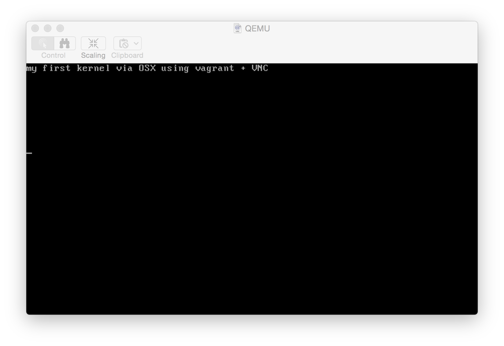

# 2015-05-30 - Let's write a Kernel

<blockquote class="twitter-tweet" data-conversation="none" data-cards="hidden" data-partner="tweetdeck"><p lang="und" dir="ltr"><a href="http://t.co/6LjOiwv0Vz">http://t.co/6LjOiwv0Vz</a></p>&mdash; Kristian Glass (<a href="https://twitter.com/doismellburning">@doismellburning<a>) <a href="https://twitter.com/doismellburning/status/603982381272453120">May 28, 2015</a></blockquote>
<script async src="//platform.twitter.com/widgets.js" charset="utf-8"></script>

**Article:** http://arjunsreedharan.org/post/82710718100/kernel-101-lets-write-a-kernel

**Time:** ~2/3h of tinkering, exploring manpages etc.

---

A very nice guide to creating your own kernel, took a bit of tweaking to make it
work via vagrant on OSX but the main article was solid. End result in my case was a VNC session to a qemu emulation for my first kernel, pretty fun!

For the proper tutorial, see the [original
article](http://arjunsreedharan.org/post/82710718100/kernel-101-lets-write-a-kernel), the below skims the main content and just breifly outlines the steps I took to get it working on OSX via vagrant.

#### 1. Set up vagrant

```
$ vagrant init hashicorp/precise32
```

Edit `Vagrantfile` to include the line:

```
config.vm.network "forwarded_port", guest: 5901, host: 6901
```

This will later allow us to connect via VNC screensharing

#### 2. Create asm for entrypoint + multiboot headers

```assembly
;;kernel.asm

;nasm directive - generate code to run in 32 bit processor mode
bits 32

section .text
        ;headers to conform to multiboot spec
        align 4
        dd 0x1BADB002            ;magic
        dd 0x00                  ;flags
        dd - (0x1BADB002 + 0x00) ;checksum. sum of these 3 fields should be zero

global start		;lets the linker know where "start" is
extern kmain	        ;kmain is defined in the c file

start:
  cli 			;clear interrupts (disable/block them)
  mov esp, stack_space	;set stack pointer to point the allocated 8KB memory
  call kmain		;call the main kernel function
  hlt		 	;halt the CPU

section .bss
resb 8192		;reserve bytes (8KB) for stack
stack_space:		;label indicates start of allocated memory above
```

#### 3. Main Kernel Code

In this case the aim is to output a message to the 80x25 screen's text memory:

```c
/*
*  kernel.c
*/
void kmain(void)
{
	const char *str = "my first linux kernel via OSX using vagrant + VNC";
	char *vidptr = (char*)0xb8000; 	//video memory begins here.
	unsigned int i = 0;

	/*
	* this loops clears the screen
	* there are 25 lines each of 80 columns; each element takes 2 bytes (16bit)
	*/
	while(i < 80 * 25 * 2) {
		vidptr[i] = ' '; //Set character to be a space
		vidptr[i+1] = 0x07; // attribute-byte - in this case, light grey on black screen
		
		j = i + 2;
	}

	i = 0; /* reset i so we can re-use it */
	unsigned int j = 0;
	
	// this loop writes the string to video memory until it's hits the null string terminator
	while(str[i] != '\0') {
		vidptr[j] = str[i]; // use the string char's ascii value
		vidptr[j+1] = 0x07; // attribute-byte: give character black bg and light grey fg
		
		i++;
		j = j + 2;
	}
	return;
}
```

#### 4. Linker Script

```ld
/*
*  link.ld
*/
OUTPUT_FORMAT(elf32-i386)
ENTRY(start)
SECTIONS
 {
   . = 0x100000;
   .text : { *(.text) }
   .data : { *(.data) }
   .bss  : { *(.bss)  }
 }
 ```

#### 5. Build Kernel

```
$ nasm -f elf32 kernel.asm -o kasm.o
```

```
$ gcc -m32 -c kernel.c -o kc.o
```

```
ld -m elf_i386 -T link.ld -o kernel kasm.o kc.o
```

I've packaged these up into a Makefile so for me this was just `make`.

#### 6. Run Kernel

You could do this using [qemu](http://wiki.qemu.org/Main_Page) and display
output using curses by passing the `-curses` flag, however it's fun to try
something different so I decided to connect via VNC.

The below sends the output
to a new vnc session which you can connect to on port 5901. You need to set a password to use
OSX screen sharing to connect, the VNC connection is available on port 6901 as
per the Vagrantfile earlier.

```
$ qemu-system-i386 -kernel kernel -no-kvm -vnc :1,password -monitor stdio
(qemu) change vnc password
Password: **********
(qemu)
```

I popped this into my Makefile so I could run it via `make vnc`

- `-no-kvm` to preventdd `Could not access KVM kernel module: No such file or directory`
- `-vnc :1,password` to send output to a VNC session on port 5901
- `monitor stdio` to allow us to define a VNC password


